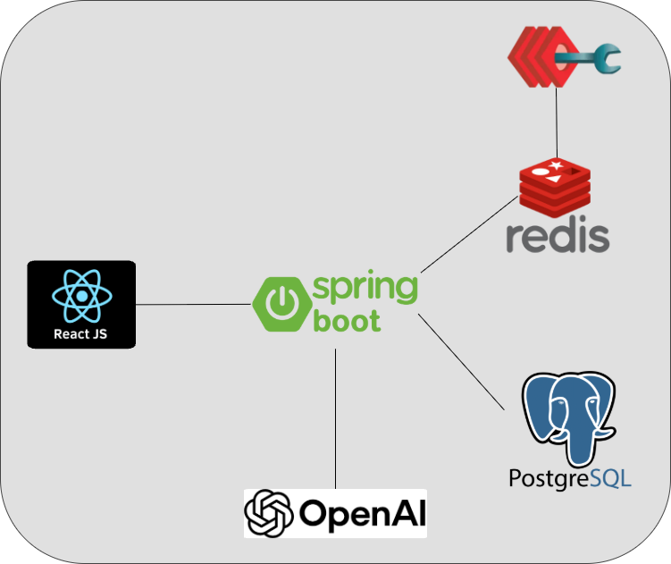

# kAIn

A full-stack web application built using **Spring Boot** (Java) for the backend and **React** (JavaScript) for the frontend—with Docker orchestration and database setup.

---

##  Table of Contents

1. About the Project]
2. User Features
3. Technical Features
4. Tech Stack
5. Architecture
6. Setup and Installation
7. Future Work

---

##  About the Project

kAIn is a full-stack, cookbook-style web application that blends recipe management with the power of AI. Users can create, save, and edit their own recipes, while also enhancing them through an integrated AI chat assistant. Whether it’s adapting a dish to dietary restrictions, substituting based on available ingredients, or getting general cooking guidance, kAIn is your personal cookbook and a sous-chef all in one.
From a technical perspective, this project is an end-to-end application that utilizes a modern React frontend, a robust Spring Boot backend, and containerized deployment with Docker. This architecture ensures scalability, ease of setup, and a clean separation of concerns—all while delivering a practical and engaging user experience.

---

##  User Features

- **Recipe Management** – Create, save, edit, and delete personal recipes  
- **AI Recipe Assistant** – Chatbot that helps modify recipes or answers general cooking questions

---

## Technical Features

- **Full-Stack Architecture** – React frontend + Spring Boot backend communicating through RESTful APIs
- **REST API Design** – Designed and documented endpoints for CRUD operations on recipes, user management, and AI-enhanced interactions
- **Database Design** – Implemented relational schemas with JPA/Hibernate for recipe and user data persistence  
- **Persistent Storage** – Recipes and user data stored in a Postgres relational database while utilizing Redis caching for fast returns
- **AI Integration** – Integrated an AI chat assistant to adapt recipes to dietary restrictions, substitute ingredients, and provide contextual cooking guidance based on user discretion
- **Containerized Deployment** – Deployed frontend, backend, database, and caching services as Docker containers for portability and reproducibility  
- **Scalability & Maintainability** – Applied layered architecture principles with clear separation of concerns between frontend, backend, and data layers  
- **Authentication & Security** – Secured API endpoints with JWT-based authentication using HttpOnly cookies
- **State Management** – Leveraged React hooks and context API for efficient client-side state handling

---
##  Tech Stack

- **Backend**: Spring Boot (Java)
- **Frontend**: React (JavaScript)
- **Database**: PostgreSQL, Redis 
- **Containerization**: Docker
- **Services**: OpenAI 3.5GPT Turbo, JWT w/ HttpOnly

---

##  Architecture

---

### Setup and Installation
1) Install Docker (v28.2.2 or later)
2) Clone repo
3) Note: if using Windows machine, must run the following in a git bash terminal:
- `dos2unix backend/mvnw`
- `docker-compose build`
- `docker-compose up -d`
4) Ensure containers are up and in good status by checking with `docker ps -a`
5) `http://localhost:3000` and enjoy! 

## Future Features
- **Ingredient-Based Suggestions** – Enter what you have in your pantry and let the AI suggest possible meals  
- **Search & Filter** – Find recipes by name, cuisine, or dietary tag  
- **Favorites** – Save and quickly access your go-to dishes  
- **Share Recipe** – Email feature to share recipes between friends 

